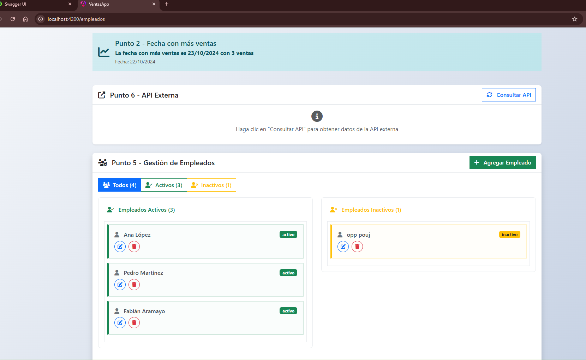
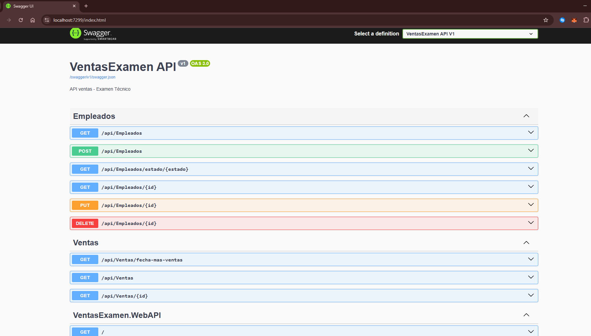

# CartaSur - Resolución

## Descripción
Sistema de gestión de ventas desarrollado con ASP.NET Core Web API y Angular. El proyecto incluye una base de datos SQL Server con entidades para empleados, clientes, productos, sucursales y ventas.

## Estructura del Proyecto

### Backend (.NET)
- **VentasExamen.Domain**: Entidades del dominio
- **VentasExamen.Application**: Servicios y DTOs
- **VentasExamen.Infrastructure**: Repositorios y contexto de base de datos
- **VentasExamen.WebAPI**: API REST

### Frontend (Angular)
- **ventas-app**: Aplicación Angular para la interfaz de usuario

### Base de Datos
- Scripts SQL para la creación de la base de datos
- Diagrama de la base de datos

## Capturas de Pantalla

### Diagrama de Base de Datos


### Frontend Angular


### Documentación de la API (Swagger)


## Tecnologías Utilizadas
- **Backend**: ASP.NET Core 8.0, Entity Framework Core, SQL Server
- **Frontend**: Angular 17
- **Base de Datos**: SQL Server

## Instalación y Configuración

### Prerrequisitos
- .NET 8.0 SDK
- Node.js y npm
- SQL Server

### Backend
1. Navegar a la carpeta del proyecto .NET
2. Restaurar dependencias: `dotnet restore`
3. Configurar la cadena de conexión en `appsettings.json`
4. Ejecutar migraciones: `dotnet ef database update`
5. Ejecutar el proyecto: `dotnet run`

### Frontend
1. Navegar a `Web y API/ventas-app`
2. Instalar dependencias: `npm install`
3. Ejecutar en modo desarrollo: `ng serve`

## Endpoints de la API
- `GET /api/empleados` - Obtener lista de empleados
- `GET /api/ventas` - Obtener lista de ventas
- `POST /api/empleados` - Crear nuevo empleado
- `POST /api/ventas` - Crear nueva venta

## Base de Datos
Los scripts SQL se encuentran en la carpeta `Base de datos/`:
- `Punto1.sql` - Creación de tablas
- `Punto2.sql` - Datos de prueba
- `Punto3.sql` - Consultas adicionales

## Estructura del Proyecto
```
CartaSur/
├── Base de datos/
│   ├── diagram_VENTAS_NORM.png
│   ├── Punto1.sql
│   ├── Punto2.sql
│   └── Punto3.sql
├── C# - ASP NET/
│   ├── VentasExamen.Domain/
│   ├── VentasExamen.Application/
│   ├── VentasExamen.Infrastructure/
│   └── VentasExamen.WebAPI/
└── Web y API/
    └── ventas-app/
```

## Autor
Desarrollado para examen técnico de CartaSur.


